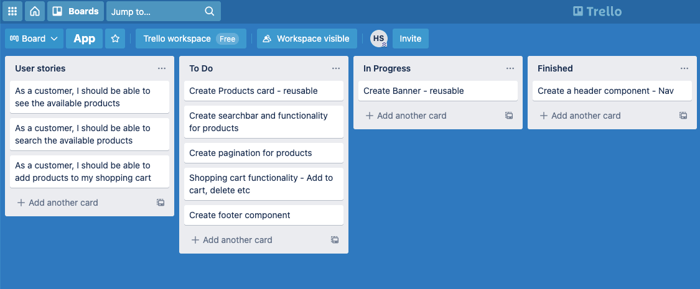

# E-Commerce App MVP made with React.

## Project Overview

The task was to build an front-end e-commerce application with API provided.

Before I started writing code, I thought it would be nice to have some kind of overview what I'm about to create. I decided to go with "Trello" to plan my next steps.



Once I had a rough idea what I needed to do, I did a quick sketch of the layout. How I would want it to look. (It's not a pretty sketch I know, but it did the job). I started mobile first with the design.


Afer this it was time to start coding. Follow the next steps to start the project and to see how it came out. Thanks!

## Installation and setup

### Clone the repository

In your terminal copy paste the following line to clone the repository

```bash
git clone git@github.com:helaris/e-commerce.git
```

### Install

Use yarn to install dependencies by running the following command in the server and client directories.

```bash
yarn install
```

### Start the application

To start the development servers you will need to run the following command in the server directory

```bash
yarn start
```

To start the development frontend you will need to run the following command in the frontend directory

```bash
yarn start
```

## Some Visuals

|                   Preview one                   |                   Preview two                   |
| :---------------------------------------------: | :---------------------------------------------: |
|  |  |

|                  Preview three                  |
| :---------------------------------------------: |
|  |
